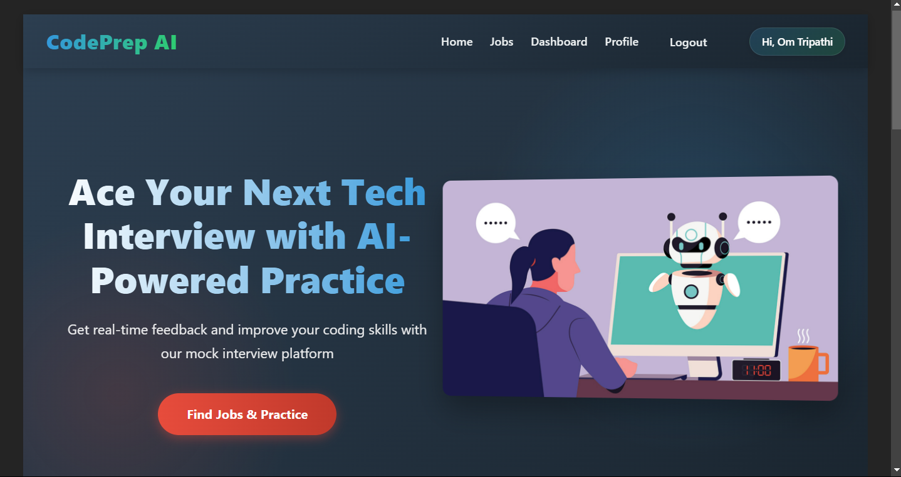
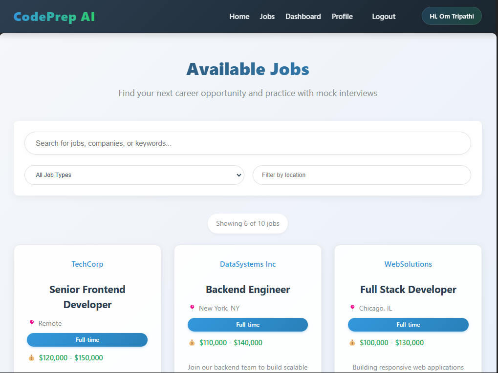
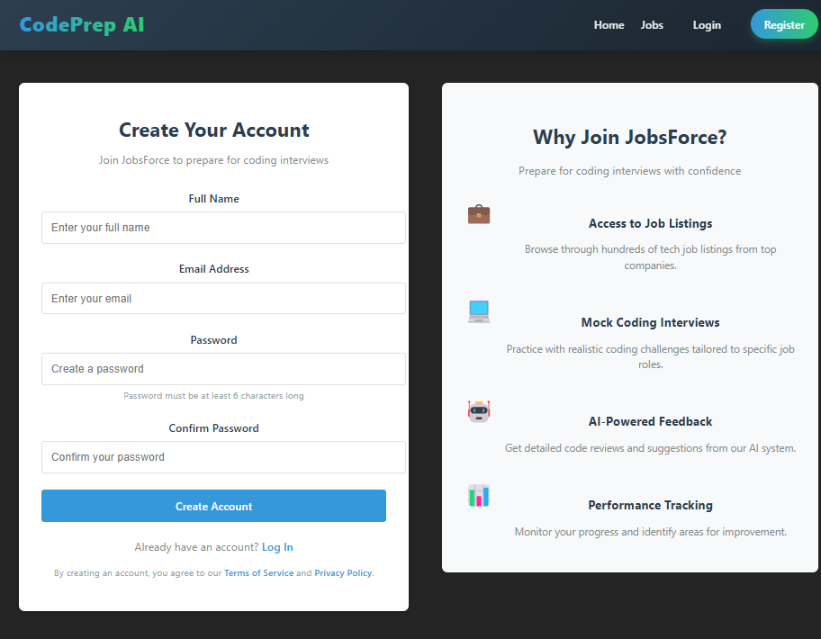

# 🚀 CodePrepAI


> An AI-powered coding interview preparation platform designed to help developers excel in technical interviews through realistic mock interviews.


### Development Highlights
- **Backend**
  - ✅ Node.js + Express.js – RESTful APIs for fetching jobs and handling code submissions
  - ✅ MongoDB – Efficient storage for user profiles, attempts, and feedback
  - ✅ Efficient API handling – Optimized for scalability and performance

- **Frontend**
  - ✅ LeetCode-style UI using React.js – Intuitive left panel (question) & right panel (editor)
  - ✅ Language selection dropdown supporting multiple programming languages
  - ✅ Smooth UX with real-time feedback after submission


## 📸 Screenshots

### Homepage
<p align="center">
  
  <br>
  <em>The landing page showcasing the platform's key features and benefits</em>
</p>

### Jobs Listing
<p align="center">
  
  <br>
  <em>Browse through a collection of job listings for targeted interview practice</em>
</p>


### Authentication
<p align="center">
  
  <br>
  <em>Secure login and registration process with JWT authentication</em>
</p>


## 🛠 Tech Stack

### Frontend
- **React.js**: Building responsive UI components
- **Vite**: Fast development and optimized builds
- **Styled Components**: Maintaining consistent UI design
- **Axios**: Handling API requests efficiently


### Backend
- **Node.js**: JavaScript runtime for server-side logic
- **Express.js**: Web framework for REST API development
- **MongoDB**: NoSQL database for flexible data storage
- **Mongoose**: Elegant MongoDB object modeling
- **JWT**: Secure authentication mechanism
- **Google Gemini API**: Advanced AI capabilities for code analysis
- **Judge0 API**: Secure code execution environment


## 🏗 System Architecture

```
                   ┌─────────────┐
                   │   Vercel    │
                   │  (Frontend) │
                   └──────┬──────┘
                          │
                          ▼
┌────────────┐     ┌──────────────┐     ┌─────────────┐
│  Browser   │◄────│     HTTPS    │────►│   NGINX     │
└────────────┘     └──────────────┘     └──────┬──────┘
                                               │
                                               ▼
┌────────────┐     ┌──────────────┐     ┌─────────────┐
│  MongoDB   │◄────│   Node.js    │◄────│    PM2      │
└────────────┘     │   Express    │     └─────────────┘
                   └──────┬───────┘
                          │
         ┌────────────────┼────────────────┐
         ▼                ▼                ▼
┌─────────────┐   ┌──────────────┐  ┌─────────────┐
│  Judge0 API │   │  Google      │  │ Other APIs  │
│(Code Exec)  │   │  Gemini API  │  │             │
└─────────────┘   └──────────────┘  └─────────────┘
```

## 🔧 Setup Instructions

### Prerequisites
- Node.js (v16.x or higher)
- MongoDB (v4.4 or higher)
- npm (v7.x or higher)
- Git

### Installation

1. **Clone the repository**
   ```bash
   git clone https://github.com/kushgit07/codeprepai.git
   cd codeprepai
   ```

2. **Install server dependencies**
   ```bash
   npm install
   ```

3. **Install client dependencies**
   ```bash
   cd client
   npm install
   ```

4. **Set up environment variables**
   
   Create `.env` file in the server directory:
   ```bash
   cd ../server
   touch .env
   ```
   
   Add the following environment variables:
   ```
   MONGODB_URI=mongodb://localhost:27017/codeprepai
   JWT_SECRET=your_jwt_secret
   PORT=5000
   NODE_ENV=development
   GEMINI_API_KEY=your_gemini_api_key
   JUDGE0_API_KEY=your_judge0_api_key
   ```

5. **Start the development servers**
   
   In the root directory:
   ```bash
   # Start backend server
   npm run server
   
   # In another terminal, start frontend
   cd client
   npm run dev
   ```

6. **Access the application**
   
   Open your browser and navigate to `http://localhost:5173`


## 📁 Project Structure

```
codeprepai/
├── .github/            # GitHub Actions workflows
├── client/             # React frontend
│   ├── public/         # Static assets
│   ├── src/            # Source files
│   │   ├── components/ # React components
│   │   ├── context/    # Context providers
│   │   ├── pages/      # Page components
│   │   ├── utils/      # Utility functions
│   │   └── App.jsx     # Main application component
│   ├── .env.production # Production environment variables
│   └── package.json    # Frontend dependencies
├── server/             # Node.js backend
│   ├── models/         # Mongoose models
│   ├── routes/         # API routes
│   ├── utils/          # Utility functions
│   ├── server.js       # Server entry point
│   └── package.json    # Backend dependencies
└── README.md           # Project documentation
```

## 👥 Contributing

Contributions are welcome! Please feel free to submit a Pull Request.

1. Fork the repository
2. Create your feature branch (`git checkout -b feature/amazing-feature`)
3. Commit your changes (`git commit -m 'Add some amazing feature'`)
4. Push to the branch (`git push origin feature/amazing-feature`)
5. Open a Pull Request

## 📄 License

This project is licensed under the MIT License - see the LICENSE file for details.

---

<p align="center">
  Built with ❤️ by <a href="https://github.com/kushgit07">KUSHAGRA SISODIA</a>
</p>
